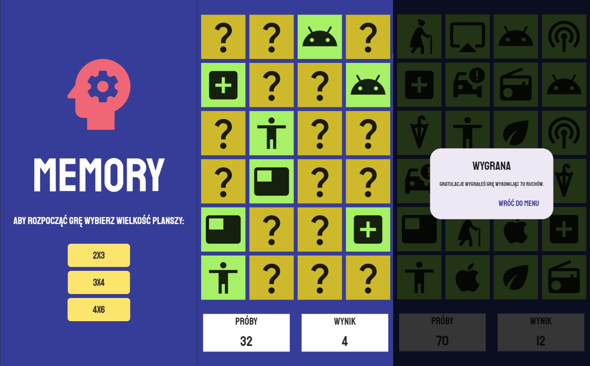

# FLUTTER MEMORY GAME

Simple memory game, created for student project.
Memory game app created as part of a student project. The application is primarily designed for mobile devices. The game offers an interactive experience where players match pairs of cards.

## Features

- Board size selection: Players can choose the size of the game board before starting, allowing them to adjust the difficulty level according to their skills.
- Attempt Count Tracking: The app keeps track of the number of attempts players make while searching for matching pairs.

## Live Demo

[Memory Game Demo Link](https://wieczorek0807.github.io/flutter_memory_game/)

## App Preview

